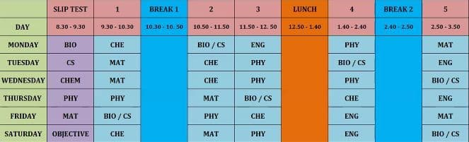

# open_online_class_link

Simple script that can help you to open online class links according to your timetable.
This is for people who join recurring meetings i.e. the same meeting link multiple times for 
different periods. This is not just for school students, it works also for job meetings. Just
adjust the [timetable](./timetable.txt) according to your need.
There is no need of searching for link, looking at the timetable, checking the day, time, etc.
The script will do that for you. You just need to install it.

## Pre-requisites
1. [Python 3](https://www.python.org) on a windows computer (other OS is also Ok)

   If you need help with installing python, visit [installpython3.com](https://www.installpython3.com)
2. Python Basics 
   (learn from [Google](https://google.com))

   Even though you are not familiar with python, you can still use it. Just follow the instructions.

### Installation

There are many ways to install it.
1. Clone it

   ```git
   git clone https://github.com/shobanchiddarth/open_online_class_link.git
   ```
2. Download [zip file](https://github.com/ShobanChiddarth/open_online_class_link/archive/refs/heads/main.zip)
3. There are 3 files, I have made it according to the timetable and subjects I had.
   
   - [subjects.txt](./subjects.txt)

      Type all your subjects line by line, in the same way I did, in all CAPS.

      It should finally look like this
      ```txt
      CHEMISTRY
      PHYSICS
      ENGLISH
      MATH
      CS
      ```

      | NOTE: This is only for reference purposes. It is not used in the program. |
      | --- |

   - [links.ini](./links.ini)

      1. Remember the syntax.
      2. Replace the name of every subject with your subject.
      3. Delete/add subjects accordingly, (according to your [subjects.txt](./subjects.txt) file)
      4. Replace the links with your meeting links
      5. It should finally look something like this
         ```ini
         [Subjects]
         CHEMISTRY=https://chemistry.example.com/meeting-link
         PHYSICS=https://physics.example.com/meeting-link
         ENGLISH=https://english.example.com/meeting-link
         MATH=https://math.example.com/meeting-link
         CS=https://cs.example.com/meeting-link
         ```

   - [timetable.txt](./timetable.txt)

      I've made it according to my timetable. Refer [timetable.jpg](./Assets/timetable.jpg)

      
      
      1. Every "noclass" in the file means it is a break
      2. NEVER CHANGE THE SYNTAX. DON'T REMOVE OR ADD ANY "|" WITHOUT PROPER REASONS.
         
         It is the seperator. It must be in the end and begginning of each and every line. And it must be
         the one seperating each period.
      3. You must use 24 hour format.
         
         The first line is for timings.

         | Timing   | Format |
         | -------- | ------ |
         | 10:00 am | 10,0   |
         | 09:00 am | 9,0    |
         | 09:30 am | 9,30   |
         | 12:00 am | 0,0    |
         | 1:00 pm  | 13,0   |

         Make sure any timing doesn't start with  `0`  and there are no two zeros in a row.

         Leave the first cell. From the next one, adjust your timings according to the given format.

         | Timing               | Format        |
         | -------------------- | ------------- |
         | 10:00 am to 11:00 am | 10,0 - 11,0   |
         | 11:50 am to 12:10 pm | 11,50 - 12,10 |

         Add / remove as many columns as you wan't.
         Make sure you also change other rows accordingly, if you delete a column, every other row
         having that column should be deleted.

      4. Leave the next line unchanged. Just add / remove whitespaces or columns (with `|`)

      5. Replace every subject name with your subject's name in each cell of the table. 
         
         - Make sure to make it in all CAPS (The same way as in [subjects.txt](./subjects.txt))
         - If it is break time, put "noclass" on that cell.
         - Add / remove as many whitespaces to make it look like a table so that you don't get confused.
      
      6. Edit the days as you wish. It must also be in CAPS.
      7. Open [definitions.py](./definitions.py). 
         
         In [line 72](./definitions.py#L72), adjust the dictionary according to your timetable.
         
         [Help on Python Dictionaries](https://www.w3schools.com/python/python_dictionaries.asp).
         More in [Google](https://www.google.com)


### Usage

Everytime you need to join the meeting, open [open_default.py](./open_default.py).
It will open the link in your default webbrowser.

To copy the link to your clipboard, open [copy_link.py](./copy_link.py).

Leave [definitions.py](./definitions.py) untouched (Unless you want to change it for your timetable, as
mentioned in [line 106](#L106))